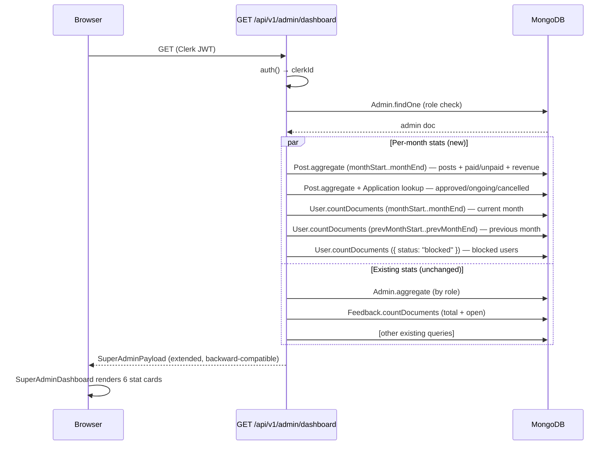

# Design Document: Admin Dashboard Stats

## Overview

This feature enriches the Super Admin dashboard with per-month data across four enhanced stat cards (Posts, Approved Posts, Registered Users, Total Revenue) while preserving two unchanged cards (Feedbacks, Total Admins). The primary goal is to give admins an immediate operational pulse on the current calendar month rather than relying on all-time global counts.

The implementation touches two layers:

1. **API layer** (`app/api/v1/admin/dashboard/route.ts`) — `getSuperAdminData` is extended with new MongoDB aggregation queries scoped to the current calendar month. No existing response keys are removed or renamed.
2. **UI layer** (`components/admin/dashboard/SuperAdminDashboard.tsx`) — the `SuperAdminPayload` TypeScript interface is extended with the new fields, the stat card grid is reordered to the specified sequence, and each new card renders the richer sub-line.

---

## Architecture



### Key Design Decisions

- **Single aggregation pipeline for Post stats** — a single `$facet` pipeline over posts in the current month computes `total`, `paid`, `unpaid`, and `revenue` in one round-trip, avoiding multiple collection scans.
- **Lookup-based approved post classification** — an `$lookup` join from `posts` → `applications` on the `postId` string field identifies approved/ongoing/cancelled posts. Mongoose already has a compound index on `{ postId: 1, status: 1 }` in the `applications` collection, so this join is efficient.
- **Growth % in the API, not the UI** — the percentage is computed server-side so the UI stays a thin presenter and the formula is testable as a pure function.
- **No breaking changes** — all new fields are additive. Existing keys (`totalUsers`, `activePosts`, `enquiries`, `revenue`, `admins`, `feedbacks`) are preserved in the payload until a future migration removes them.

---

## Components and Interfaces

### Extended `SuperAdminPayload`

```typescript
export interface SuperAdminPayload {
  role: "super_admin";
  stats: {
    // ── Existing keys (preserved, unchanged) ────────────────────────────
    totalUsers: number;
    activePosts: number;
    enquiries: { new: number; inProgress: number; total: number };
    revenue: number;
    admins: Record<string, number>;
    feedbacks: { total: number; open: number };

    // ── New per-month keys (additive) ────────────────────────────────────
    postsThisMonth: {
      total: number;
      paid: number;
      unpaid: number;
    };
    approvedPostsThisMonth: {
      approved: number;
      ongoing: number;
      cancelled: number;
    };
    usersThisMonth: {
      total: number;
      growthPct: number;   // rounded to 1 decimal, can be negative
      blocked: number;     // all-time blocked count, not month-scoped
    };
    revenueThisMonth: number;  // sum of monthlyBudget on paid posts this month
  };
  // ── Other top-level keys unchanged ──────────────────────────────────────
  postsByStatus: Record<string, number>;
  recentPayments: Array<{ ... }>;
  recentEnquiries: Array<{ ... }>;
  revenueTrend: Array<{ _id: string; total: number }>;
  recentAuditLog: Array<{ ... }>;
}
```

### API Helper: `computeMonthBounds`

```typescript
function computeMonthBounds(now: Date): {
  monthStart: Date;
  monthEnd: Date;
  prevMonthStart: Date;
  prevMonthEnd: Date;
}
```

Extracted as a pure function so it is independently testable. Uses server local time as specified in the requirements.

```typescript
function computeMonthBounds(now: Date) {
  const year  = now.getFullYear();
  const month = now.getMonth(); // 0-indexed
  return {
    monthStart:     new Date(year, month,     1,  0,  0,  0,   0),
    monthEnd:       new Date(year, month + 1, 0, 23, 59, 59, 999),
    prevMonthStart: new Date(year, month - 1, 1,  0,  0,  0,   0),
    prevMonthEnd:   new Date(year, month,     0, 23, 59, 59, 999),
  };
}
```

### API Helper: `computeGrowthPct`

```typescript
function computeGrowthPct(current: number, previous: number): number
```

Pure function, returns a number rounded to 1 decimal place. Handles the `previous === 0` edge case using `Math.max(previous, 1)`.

```typescript
function computeGrowthPct(current: number, previous: number): number {
  const pct = ((current - previous) / Math.max(previous, 1)) * 100;
  return Math.round(pct * 10) / 10;
}
```

### UI: Updated `StatCard` grid

The existing `StatCard` component is reused unchanged. Only the data passed to each card changes. The grid order is updated to match the requirement:

1. Posts (total / paid / unpaid)
2. Approved Posts (approved / ongoing / cancelled)
3. Registered Users (growth % / blocked)
4. Feedbacks (preserved)
5. Total Revenue (monthly budget sum)
6. Total Admins (preserved)

The `xl:grid-cols-4` class is removed; the grid uses `grid-cols-2 lg:grid-cols-3` to achieve two rows of three on large screens.

---

## Data Models

### Relevant model fields (read-only — no schema changes)

| Model | Collection | Fields used |
|---|---|---|
| `Post` | `posts` | `paymentstatus` (`done`/`pending`/absent), `monthlyBudget` (Number), `status` (`open`,`matched`,`closed`,`cancelled`,`hold`), `postId` (String), `createdAt` |
| `Application` | `applications` | `postId` (String), `status` (`applied`,`DC`,`GC`,`approved`,`decline`,`auto_declined`,`withdrawn`), `createdAt` |
| `User` | `users` | `status` (`active`,`blocked`,`deleted`), `createdAt` |

No schema migrations are required.

### MongoDB Query Strategy

#### Posts stat + Revenue (single `$facet` pipeline)

```javascript
Post.aggregate([
  { $match: { createdAt: { $gte: monthStart, $lte: monthEnd } } },
  {
    $facet: {
      totalAndPayment: [
        {
          $group: {
            _id: null,
            total:   { $sum: 1 },
            paid:    { $sum: { $cond: [{ $eq: ["$paymentstatus", "done"] }, 1, 0] } },
            revenue: { $sum: { $cond: [{ $eq: ["$paymentstatus", "done"] }, "$monthlyBudget", 0] } },
          }
        }
      ]
    }
  }
])
```

`unpaid = total − paid` is computed in application code.

#### Approved / Ongoing / Cancelled Posts (lookup pipeline)

```javascript
Post.aggregate([
  { $match: { createdAt: { $gte: monthStart, $lte: monthEnd } } },
  {
    $lookup: {
      from: "applications",
      localField: "postId",
      foreignField: "postId",
      as: "applications",
    }
  },
  {
    $addFields: {
      isApproved: {
        $gt: [
          { $size: { $filter: { input: "$applications", cond: { $eq: ["$$this.status", "approved"] } } } },
          0
        ]
      },
      hasInProgress: {
        $gt: [
          { $size: { $filter: { input: "$applications", cond: { $in: ["$$this.status", ["DC", "GC"]] } } } },
          0
        ]
      },
    }
  },
  {
    $group: {
      _id: null,
      approved: {
        $sum: { $cond: ["$isApproved", 1, 0] }
      },
      ongoing: {
        $sum: {
          $cond: [
            {
              $and: [
                { $eq: ["$isApproved", false] },
                { $ne: ["$status", "cancelled"] },
                "$hasInProgress"
              ]
            },
            1, 0
          ]
        }
      },
      cancelled: {
        $sum: {
          $cond: [
            {
              $and: [
                { $eq: ["$isApproved", false] },
                { $eq: ["$status", "cancelled"] }
              ]
            },
            1, 0
          ]
        }
      },
    }
  }
])
```

This satisfies the mutual-exclusivity constraints from Requirements 2.3–2.5: approved takes priority, then ongoing (in-progress but not cancelled and not approved), then cancelled.

#### User stats (three parallel `countDocuments` calls)

```javascript
// Current month new users
User.countDocuments({ createdAt: { $gte: monthStart, $lte: monthEnd } })

// Previous month new users (for growth %)
User.countDocuments({ createdAt: { $gte: prevMonthStart, $lte: prevMonthEnd } })

// All-time blocked users
User.countDocuments({ status: "blocked" })
```

### Existing indexes that support the new queries

| Query | Index |
|---|---|
| Posts filtered by `createdAt` | `{ status: 1, createdAt: -1 }` covers range scans on `createdAt` |
| Applications by `postId` + `status` | `{ postId: 1, status: 1 }` (explicit in `ApplicationSchema`) |
| Users by `createdAt` | `{ timestamps: true }` — Mongoose adds `createdAt`; a compound index `{ createdAt: 1 }` on `users` is advisable for production load but not strictly required for correctness |
| Users by `status` | `{ status: 1 }` (explicit in `userSchema`) |

---

## Correctness Properties

*A property is a characteristic or behavior that should hold true across all valid executions of a system — essentially, a formal statement about what the system should do. Properties serve as the bridge between human-readable specifications and machine-verifiable correctness guarantees.*

### Property 1: Paid/Unpaid partition is exhaustive and exclusive

*For any* list of Posts in the current month, the count of Paid Posts plus the count of Unpaid Posts must equal the total Posts count.

**Validates: Requirements 1.3**

### Property 2: Month bounds are non-overlapping and cover the full month

*For any* date input, `monthStart` is midnight on the 1st of that calendar month, `monthEnd` is 23:59:59.999 on the last day of that month, `prevMonthEnd` is exactly one millisecond before `monthStart`, and the union of `[prevMonthStart, prevMonthEnd]` and `[monthStart, monthEnd]` contains no gaps and no overlap.

**Validates: Requirements 8.1, 8.2**

### Property 3: Growth percentage handles zero-denominator safely

*For any* pair of non-negative integers `(current, previous)`, `computeGrowthPct(current, previous)` must return a finite number — never `Infinity`, `NaN`, or throw — and when both are `0` it must return `0.0`.

**Validates: Requirements 3.4, 3.5**

### Property 4: Approved/Ongoing/Cancelled classification is mutually exclusive

*For any* set of Posts created in the current month (each with any combination of `status` and associated Application statuses), every Post is assigned to at most one classification (approved, ongoing, or cancelled), and approved takes priority over the other two.

**Validates: Requirements 2.3, 2.4, 2.5**

### Property 5: Revenue equals sum of monthlyBudget on paid posts

*For any* set of Posts in the current month, `revenueThisMonth` must equal the exact arithmetic sum of `monthlyBudget` for Posts where `paymentstatus === "done"`, and Posts with `paymentstatus !== "done"` (or absent) must contribute `0` to the sum.

**Validates: Requirements 5.2**

### Property 6: Growth percentage formula round-trip

*For any* non-negative integer pair `(current, previous)` with `previous > 0`, `computeGrowthPct(current, previous)` must equal `Math.round(((current - previous) / previous) * 100 * 10) / 10`.

**Validates: Requirements 3.2**

---

## Error Handling

### API errors

- All new queries run inside the existing `try/catch` in the `GET` handler. If any query throws (e.g., DB connection lost), `handleApiError` returns a `500` response and the client receives an error JSON — the same behaviour as today.
- New aggregations that return empty results (`[]`) are normalised to `{ total: 0, paid: 0, unpaid: 0, ... }` before being placed in the payload, so the client never receives `undefined` for numeric fields.

### UI error states

- The `SuperAdminDashboard` component currently does not render if `data` is absent (the parent page handles loading/error states). No changes are needed to the error boundary.
- For the two new cards that show currency or percentages, the `fmtCurrency` and `fmt` helpers already handle `0` gracefully (`₹0` and `0`).
- The growth percentage sign logic: `+` prefix is added for positive values, `-` for negative (from `Intl.NumberFormat` sign behaviour or manual prefix), and no sign for exactly `0.0`.

### Edge cases

| Scenario | Handled by |
|---|---|
| No posts this month | `$facet` returns `[{}]`; normalise to all-zeros |
| `monthlyBudget` missing on a post | Post model requires `monthlyBudget` (required: true), so this cannot occur in valid data |
| `paymentstatus` absent | Treated as `unpaid` by the `$cond` expression (checks `$eq: ["done"]`) |
| Previous month = January (month index 0) | `new Date(year, -1, 1)` → December of previous year — JavaScript `Date` handles month underflow correctly |
| `growthPct` for 0 → 0 case | Returns `0.0` (not `+0.0`) per Requirement 3.4; the UI formats this as `0.0% vs last month` |

---

## Testing Strategy

### Unit tests (example-based)

| Target | Test scenario |
|---|---|
| `computeMonthBounds` | Returns correct `monthStart`/`monthEnd` for mid-month date, first day, last day, January (month underflow), December (month overflow to next year) |
| `computeGrowthPct` | `(0, 0) → 0.0`, `(10, 0) → 1000.0`, `(12, 10) → 20.0`, `(8, 10) → -20.0`, `(10, 3) → 233.3` |
| `SuperAdminDashboard` render | Renders all 6 cards in the correct DOM order with correct labels and sub-lines using React Testing Library |
| Revenue formatting | `fmtCurrency(150000) === "₹1,50,000"` |

### Property-based tests

The property-based testing library for this project is **fast-check** (TypeScript-native, works with Jest/Vitest, widely used in Next.js projects).

Each test runs a minimum of **100 iterations**.

| Property | Generator strategy |
|---|---|
| **Property 1** — paid+unpaid = total | Generate a random array of Post-like objects with `paymentstatus` ∈ `["done", "pending", undefined]`; run the grouping logic; assert sum |
| **Property 2** — month bounds cover full month | Generate random `Date` values across any calendar month; call `computeMonthBounds`; assert start/end invariants and adjacency to prev-month bounds |
| **Property 3** — growth % never throws | Generate arbitrary pairs `(current: nat, previous: nat)`; call `computeGrowthPct`; assert `isFinite` and special case for `(0, 0)` |
| **Property 4** — classification mutual exclusivity | Generate random Post/Application combos; run the classification logic; assert each post lands in exactly one bucket |
| **Property 5** — revenue = sum of paid budgets | Generate random arrays of posts with `paymentstatus` and `monthlyBudget`; compute expected sum manually; compare to `revenueThisMonth` |
| **Property 6** — growth formula round-trip | Generate `(current: pos, previous: pos)`; compare `computeGrowthPct` to inline reference formula |

Tag format for each test: `// Feature: admin-dashboard-stats, Property {N}: {property_text}`

### Integration tests

- The full `getSuperAdminData` function should be tested against a real MongoDB (or `mongodb-memory-server`) instance with seed data covering: empty month, single paid post, mixed paid/unpaid, approved + ongoing + cancelled posts in same month, January boundary.
- These are heavier and intended to run in CI, not local watch mode.
